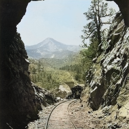

# Colorization CGAN
A Conditional Generative Adversarial Network (CGAN) to colorize grayscale images.

This project was coded in Jupyter Notebooks using Python.

The aim of this project was to develop a model that could be trained on color images and then 
be used to colorize historical black and white images. Below is a table of several images taken by
William Henry Jackson in the 19th century which have been colorized by the places2 model.

