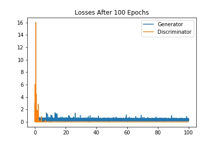
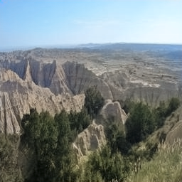
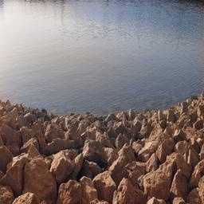
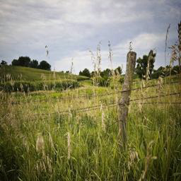
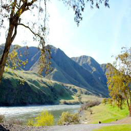

# Colorization CGAN
A Conditional Generative Adversarial Network (CGAN) capable of colorizing grayscale images.

This project was coded in Jupyter Notebooks using Python. More details about colorization theory,
implementation, tests, discussion, etc. can be found in [my undergraduate research thesis](https://drive.google.com/file/d/10PYoKT_YwOIlvwnCFpDo6Mz5gK7t0GaC/view?usp=sharing) completed at Elon University.

## Goal
The aim of this project was to develop a model that could be trained on color images and then 
be used to colorize historical black and white images. Below is a table of several images taken by
William Henry Jackson in the 19th century which have been colorized by a model trained on nature landscapes from the places2 dataset.

|Image Name|Original|Colorized||Image Name|Original|Colorized|
|:---:|:---:|:---:|:---:|:---:|:---:|:---:|
|*Cameron's Cone*, 1879|  |  ||*Cumbres Mountain*, 1880|  |  |
|*Fremont's Peak*, 1878|  |  ||*Georgetown*, 1873|  |  |
|*Shadow Lake*, 1871|  |  ||*Sierra San Juan*, 1874|  |  |

## Code
### Training the CGAN
CGAN code can be found in [colorization_pix2pix.ipynb](colorization_pix2pix.ipynb).

Grab some images to train/test, set training parameters, and let your computer fume for the next couple days. Below are a
couple features of the code.

As the model trains, it will output predictions on the training set after each epoch. This way, you can see the model converge (or fail spectacularly) in real time.

*The images in the figure are: Ground Truth | Grayscale | Predictions 1 ... n |*

It will also output a loss curve, which is updated at the end of each epoch.

Once the model's done training, it will output predictions on the test set.

*Just like in training, the images in the figure are: Ground Truth | Grayscale | Predictions 1 ... n |*

### Testing the CGAN
Code to test an already-trained model can be found in [colorization_test_model.ipynb](colorization_test_model.ipynb).

Do you want to load a saved model and produce more predictions? This is the code for you!

This program allows you to save each prediction from a model individually ([colorization_pix2pix.ipynb](colorization_pix2pix.ipynb) saves them all in one figure). It is also able to randomly save ground truth
(original) images and colorizations from your test set, perfect for generating data for a user study to measure
the realism of your output. (Check out pg. 44 in [our paper](https://drive.google.com/file/d/10PYoKT_YwOIlvwnCFpDo6Mz5gK7t0GaC/view?usp=sharing) to see how students at Elon University faired at discriminating between the two)

Below are some randomly selected ground truths and colorized images. Can you tell which are which?
|||||
|---|---|---|---|

  
Answer

  The first two images have been colorized by my places2 model, the last two are original color images.

### Various Helper Programs
This project required several programs to test features, generate artificial datasets, scale images to 256x256, etc.
All extraneous code can be found in the [Helper Programs](https://github.com/drew-bowman/Colorization/tree/master/Helper%20Programs) folder.

### Directory Structure
My code is set up for the following structure, but it can easily be tweaked.
- colorization_pix2pix.ipynb
- colorization_test_model.ipynb
- ...and all other .ipynb files
- Output/
  - colorization_pix2pix.ipynb will automatically create a folder for each training containing the following:
    * In-progress training images every epoch
    * Model weights every 5 epochs
    * Generator/discriminator loss curve
    * Test images after training completed
- Test_Output/
  - colorization_test_model.ipynb will automatically create folders for final test images here
- lsun/ (or whatever dataset you have downloaded)
  - train/
    - subdir/ (subdirectory required to read in large datasets using ImageDataGenerator in Keras)
      - train_0001.jpg
      - train_0002.jpg
      - ...
  - test/ (no subdirectories needed unless reading in a crazy amount of test images)
    - train_0001.jpg
    - train_0002.jpg
  

## Final Models
I've included the weights for my final colorization models in the [Final Model Weights](https://github.com/drew-bowman/Colorization/tree/master/Final%20Model%20Weights) folder.

The LSUN model colorizes bedroom interiors and the places2 model colorizes natural landscapes.

**Enjoy!**
